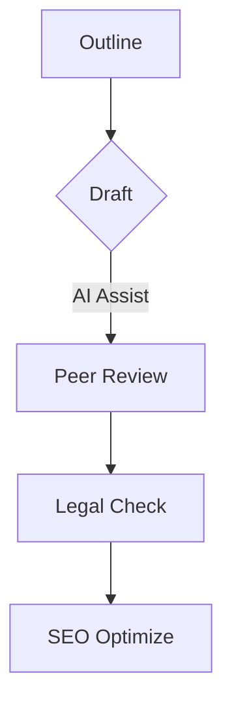

# Content Authoring Guide

## Table of Contents

- [Content Authoring Guide](#content-authoring-guide)
  - [Table of Contents](#table-of-contents)
  - [Content Standards](#content-standards)
  - [Thought Leadership Content Standards](#thought-leadership-content-standards)
  - [SEO Guidelines](#seo-guidelines)
  - [AI Integration](#ai-integration)

## Content Standards

## Thought Leadership Content Standards

## SEO Guidelines

*Placeholder for keyword strategy and metadata templates*

## AI Integration

*Placeholder for LLM prompting standards and validation workflows*
