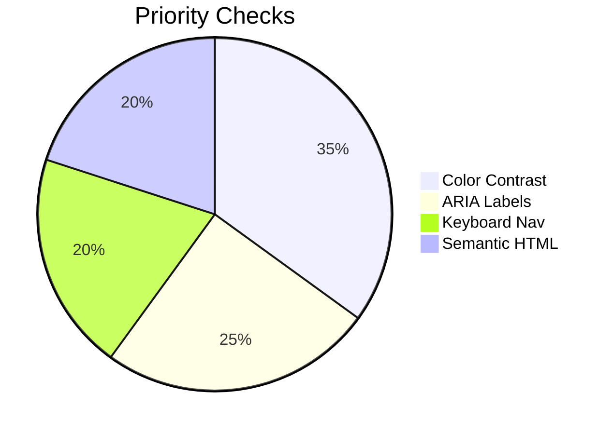
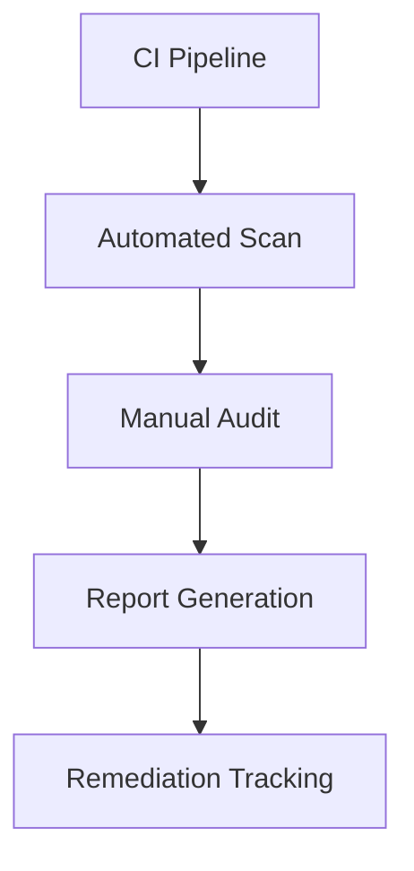

# Accessibility Standards

## Table of Contents

- [Accessibility Standards](#accessibility-standards)
  - [Table of Contents](#table-of-contents)
  - [WCAG Compliance](#wcag-compliance)
  - [Testing Procedures](#testing-procedures)
  - [Component Library](#component-library)
    - [Accessible Patterns](#accessible-patterns)

## WCAG Compliance

## Testing Procedures

## Component Library

### Accessible Patterns

- [ ] Navigation Menu (ARIA)
- [ ] Form Validation
- [ ] Modal Dialogs
- [ ] Data Tables
