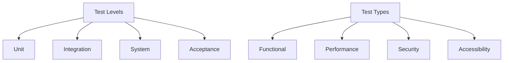
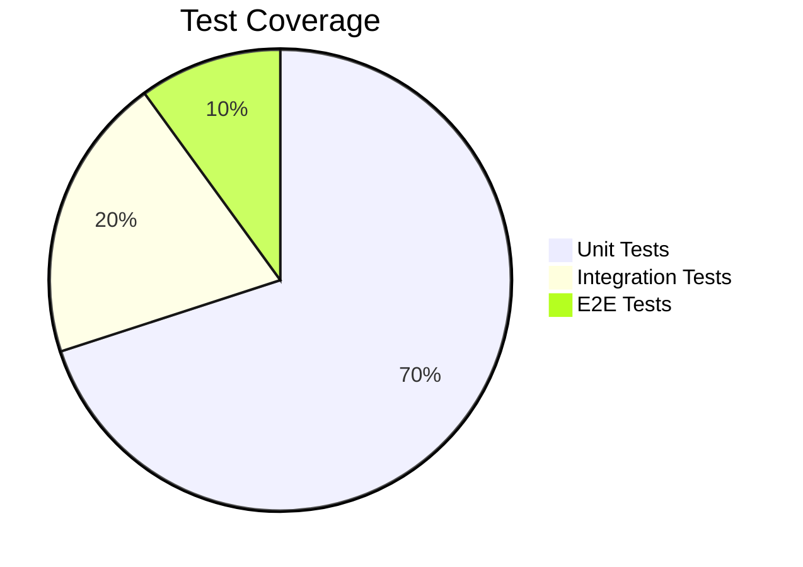

# Comprehensive Test Plan

## Test Strategy



## Test Automation Framework

```ruby
# test_helper.rb
require 'minitest/autorun'
require 'jekyll'

class JekyllTest < Minitest::Test
  def setup
    @site = Jekyll::Site.new(Jekyll.configuration)
    @site.process
  end

  def test_build_integrity
    assert File.exist?("_site/index.html"), "Missing index.html"
    assert File.exist?("_site/assets/css/main.css"), "Missing main.css"
  end

  def test_css_size
    css_size = File.size("_site/assets/css/main.css")
    assert css_size < 150_000, "CSS exceeds 150KB budget"
  end
end
```

## Test Execution Workflow

1. **Pre-Commit**
   - Run unit tests
   - Validate Markdown syntax
   - Check frontmatter structure

2. **CI Pipeline**
   - Execute integration tests
   - Run accessibility scans
   - Perform visual regression testing
   - Validate performance budgets

3. **Post-Deploy**
   - Execute smoke tests
   - Run end-to-end tests
   - Monitor production metrics

## Test Coverage Requirements



## Test Data Management

1. **Fixtures**
   - Sample posts
   - Test images
   - Mock API responses

2. **Test Environments**
   - Local development
   - Staging
   - Production-like

## Reporting & Metrics

1. **Key Metrics**
   - Test coverage percentage
   - Defect detection rate
   - Mean time to detect failures
   - Test execution time

2. **Reporting Tools**
   - Allure reports
   - CI dashboard
   - Slack notifications
