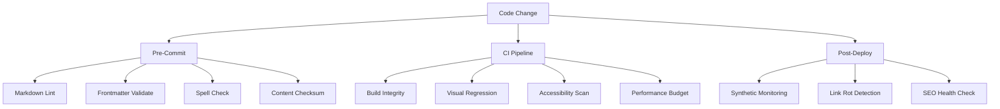
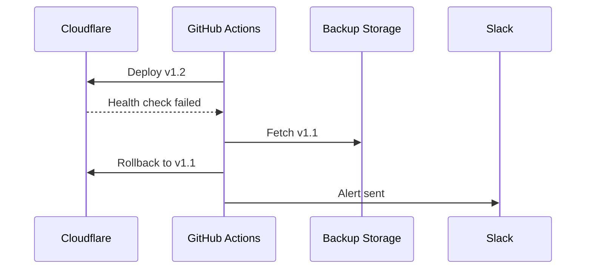
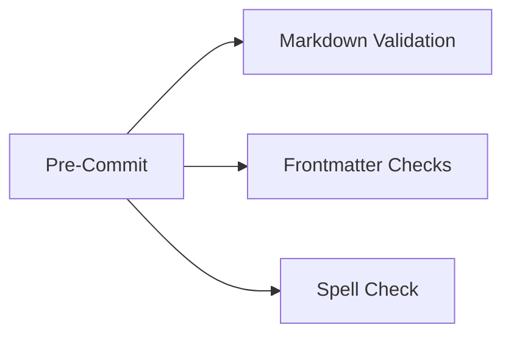

# Zero-Tolerance Testing Protocol

## Multi-Layer Verification System



## Implementation Checklist

```ruby
# _plugins/build_verifier.rb
module Jekyll
  class BuildVerifier < Generator
    def generate(site)
      # Verify critical build outputs
      required_files = %w[index.html assets/css/main.css]
      missing = required_files.reject { |f| File.exist?("_site/#{f}") }
      raise "Build missing critical files: #{missing}" unless missing.empty?

      # Generate content checksum
      checksum = Digest::SHA256.hexdigest(File.read("_site/index.html"))
      File.write("_site/.build_checksum", checksum)
    end
  end
end
```

## Quality Gates

1. **Pre-Commit**
   - Markdown validation (mdformat)
   - Frontmatter schema validation
   - Spell checking (cspell)
   - Content checksum verification

2. **CI Pipeline**
   - Visual regression testing (Percy)
   - Accessibility scanning (axe-core)
   - Performance budgets (Lighthouse)
   - Broken link detection (lychee)

3. **Post-Deploy**
   - Synthetic monitoring (Checkly)
   - SEO health checks (Screaming Frog)
   - Security headers validation
   - Content integrity checks
  A --> A2[Spell Check]
  B[Pre-Deploy] --> B1[Visual Regression]
  B --> B2[HTMLProofer]
  C[Post-Deploy] --> C1[Synthetic Monitoring]
  C --> C2[Performance Budget]

```

## Core Test Types

| Test Scope          | Tools                          | Failure Threshold          |
|---------------------|--------------------------------|----------------------------|
| Build Integrity     | jekyll-build, ruby-debug       | Any build warning          |
| Content Structure   | yamllint, json-schema          | Invalid frontmatter        |
| Visual Consistency  | Percy, Happo                   | >0.1% pixel variance       |
| Accessibility       | Axe, Pa11y                     | Any critical violations    |
| Performance         | Lighthouse CI                  | Score <90                  |

## Safety Mechanisms

**1. Content Checksum Validation**

```ruby
# _plugins/content_checksum.rb
Jekyll::Hooks.register :site, :post_write do |site|
  Digest::SHA256.file("_site/index.html").to_s != ENV["PREV_SHASUM"] && raise("Content checksum mismatch")
end
```

**2. Automated Rollback Workflow**



**3. Progressive Exposure**

```yaml
# _config.yml
features:
  new_search:
    enabled: false
    percentage: 0 # Canary control

# Enable via environment variable
JEKYLL_ENV=production bundle exec jekyll build --config "_config.yml,_config_prod.yml"
```

## Risk Mitigations

```ruby
# _plugins/content_checksum.rb
Jekyll::Hooks.register :site, :post_write do |site|
  current_shasum = Digest::SHA256.file("_site/index.html").to_s
  previous_shasum = File.read(".shasum") rescue nil

  if previous_shasum && current_shasum != previous_shasum
    raise "Content checksum mismatch - possible regression detected"
  end

  File.write(".shasum", current_shasum)
end
```

## Implementation Roadmap

1. **Week 1**: Core build validation + HTMLProofer
2. **Week 2**: Visual regression baseline + accessibility
3. **Week 3**: Synthetic monitoring + perf budgets
4. **Week 4**: Chaos engineering (link rot simulation)

Testing scope expands progressively while maintaining &lt;1min feedback loops for core checks.

## Core Documents Outline

**1. `docs/development/testing-guide.md`**

```markdown
# Zero-Tolerance Testing Protocol

## Static Analysis


## Visual Regression

```yaml
# .percy.yml
version: 2
snapshot:
  widths: [375, 1280]
  min-height: 1024
  enable-javascript: true
```

## Implementation Strategy

1. Create documentation framework with placeholder TOCs
2. Automate doc validation via GitHub Actions
3. Integrate with Jekyll's existing search
4. Add documentation health checks to CI pipeline

Switch to Code mode to implement initial documentation structure.

## Performance Testing

*Placeholder for Lighthouse CI configuration*

## Accessibility Checks

*Placeholder for Pa11y implementation details*
