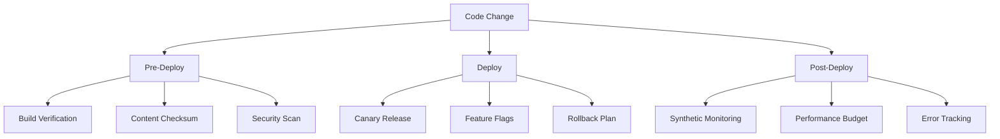

# Deployment Checklist v2.0

## Table of Contents

- [Deployment Checklist v2.0](#deployment-checklist-v20)
  - [Table of Contents](#table-of-contents)
  - [Modernized Deployment Workflow](#modernized-deployment-workflow)
  - [Pre-Deployment](#pre-deployment)
  - [Progressive Rollout Process](#progressive-rollout-process)
  - [Post-Deployment](#post-deployment)
  - [Post-Deployment](#post-deployment-1)

## Modernized Deployment Workflow



## Pre-Deployment

1. **Build Verification**
   - Validate Jekyll build integrity
   - Check critical file existence
   - Verify content checksums

2. **Security Checks**
   - Validate CSP headers
   - Verify HTTPS enforcement
   - Check dependency vulnerabilities

3. **Performance Budget**
   - CSS size < 150KB
   - JS size < 300KB
   - Image optimization complete

## Progressive Rollout Process

```ruby
# _plugins/deploy_verifier.rb
module Jekyll
  class DeployVerifier < Generator
    def generate(site)
      # Verify deployment readiness
      raise "Missing critical files" unless File.exist?("_site/index.html")
      raise "CSS exceeds budget" if File.size("_site/assets/css/main.css") > 150_000
    end
  end
end
```

## Post-Deployment

1. **Monitoring**
   - Uptime checks
   - Performance metrics
   - Error tracking

2. **Rollback Protocol**
   - Automated rollback on critical failures
   - Manual override capability
   - Version pinning

## Post-Deployment

*Placeholder for monitoring setup details*
