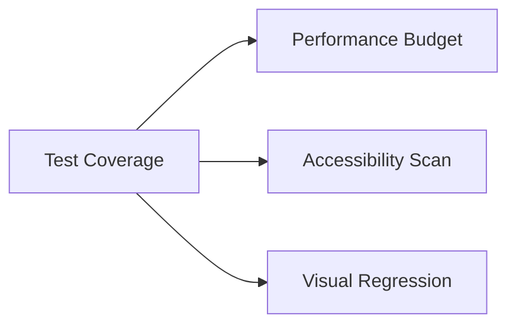

# Deployment Checklist

## Table of Contents

- [Deployment Checklist](#deployment-checklist)
  - [Table of Contents](#table-of-contents)
  - [Pre-Deployment](#pre-deployment)
  - [Progressive Rollout Process](#progressive-rollout-process)
  - [Post-Deployment](#post-deployment)

## Pre-Deployment



## Progressive Rollout Process

```ruby
# Example feature flag
Jekyll::Hooks.register :posts, :pre_render do |post|
  next unless ENV['NEW_SEARCH_ENABLED']
  post.content.gsub!(//, '')
end
```

## Post-Deployment

*Placeholder for monitoring setup details*
