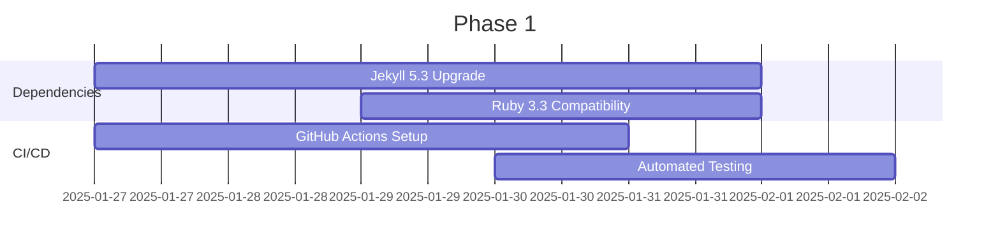
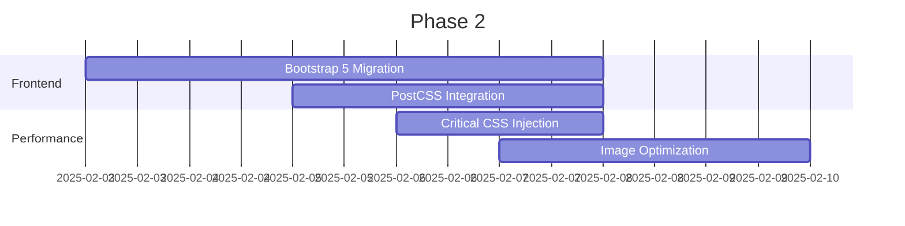
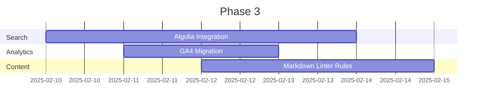
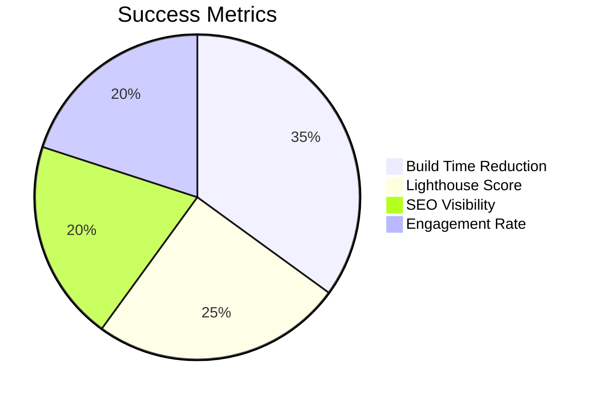

# Jekyll Modernization Roadmap

## Phase 1: Core Infrastructure (1-2 Weeks)



## Phase 2: Frontend Modernization (2-3 Weeks)



## Phase 3: Content System (1-2 Weeks)



## Key Metrics



## Implementation Strategy

1. Create feature branches for each phase
2. Implement monitoring via Cloudflare Web Analytics
3. Use automated visual regression testing
4. Gradual rollout with canary deployments

## Risk Mitigation

```ruby
# _plugins/rollback.rb
module Jekyll
  class Rollback < Generator
    def generate(site)
      # Verify critical build outputs
      required_files = %w[index.html assets/css/main.css]
      missing = required_files.reject { |f| File.exist?("_site/#{f}") }
      raise "Build missing critical files: #{missing}" unless missing.empty?
    end
  end
end
